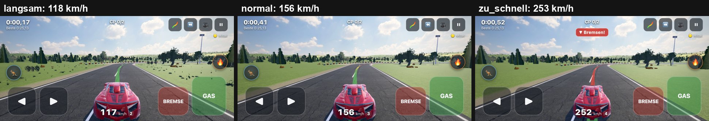
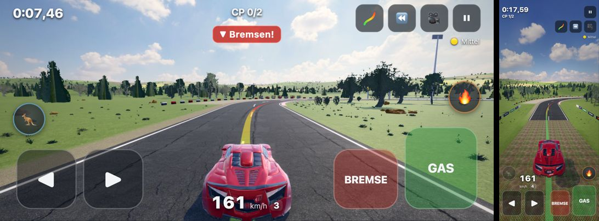
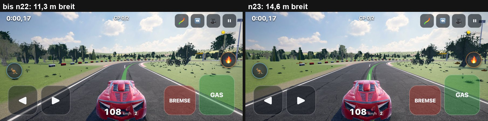

# Mittel wieder fahrbar (n23, 03.10.2026)

## Was ändert sich beim Fahren
1. **Mittel läuft in Echtzeit** (vorher 25 % zu schnell): Die km/h-Zahl ist jetzt das Tempo, das du siehst. Die Beschleunigung bleibt: 0–200 km/h dauert wie vorher 2,8 echte Sekunden.
2. **Mehr Haftung, kein Ausbrechen:** Traktionskontrolle (Vollgas aus der Kurve dreht nicht mehr), Schleuderschutz wie ein ESP und Haftung ×1,3. Kurven gehen gut 30 % schneller als auf Original. Es gibt weiter keine Schiene: Wer zu schnell ist, rutscht.
3. **Handy-Pfeile lenken weich:** Ein kurzer Tipp gibt eine kleine Korrektur, langes Halten mehr Einschlag. Bei Tempo baut sich der Einschlag langsamer auf. Bisher gab jeder Tipp sofort vollen Einschlag, bei 200 km/h hat das das Auto quergerissen.
4. **Mehr Zeit zum Reagieren:** „Bremsen!“ kommt tempoabhängig früher (bei 130 km/h etwa 0,5 s früher als bisher). Die Kamera schaut bei Tempo höher und weiter voraus. Die **Ideallinie färbt sich nach deinem Tempo**: grün = passt, gelb = vom Gas, orange bis rot = bremsen. Langsam bleibt sie grün.
5. **Breitere Strecke auf allen Stufen:** Die Fahrbahn ist 14,6 m statt 11,3 m breit. Loopings, Röhren, Korkenzieher und die Autobahn behalten ihr Maß.

**Zum Vergleich am Handy:** `?m=n16` fährt Mittel wie bisher, `?breit=alt` mit der alten schmalen Fahrbahn, `?dynlinie=0` zeigt die Linie mit festen Farben. A/B-Links werten keine Bestzeit (Regel aus n21).

---

## Warum Spieltempo 1,0 und nicht nur eine andere Tacho-Zahl (Punkt A)
- Bis n22 lief die Simulation 25 % schneller als die Uhr, der Tacho zeigte aber die Physik-km/h. Bei „160 km/h“ flog die Welt also mit 200 km/h vorbei.
- Peters Test mit `?speed=1` hat geholfen. Ein Spieler am Handy hat damit 25 % mehr Zeit für jede Reaktion. Eine größere Tacho-Zahl allein hätte nur die Anzeige geändert, nicht die Reaktionszeit.
- Damit die Beschleunigung nicht nachlässt, hat Mittel 25 % mehr Antriebskraft. Bis 440 km/h begrenzt die Antriebskraft und nicht die Motorleistung, deshalb bleibt die Höchstgeschwindigkeit gleich.
- Rennzeiten zählen weiter in Spielzeit. Das Spieltempo ändert also keine Bestzeit.
- Leicht und Original bleiben bei 1,25. Dort zeigt der Tacho weiter die Physik-km/h, beide Stufen sollen unverändert bleiben. Will Peter das auch dort: eine Zeile in `race.js` (`ASSISTS.*.speed`).
- **Nahdetails:** Der Mittelstreifen war 4 m Strich / 5 m Lücke. Jetzt sind es 6 m / 12 m wie auf der Autobahn. Er flimmert bei Tempo nur noch halb so oft vorbei und passt zur breiten Fahrbahn.
- Randlinien (16 cm), Randsteine und Deko passen zum Maßstab (Fotos geprüft).
- Die Sichtfeld-Weitung bei Tempo ist auf Mittel halbiert (höchstens +10° statt +20°). Die Ferne bleibt dadurch größer.

## Messungen

### Beschleunigung, Kurvengrenztempo, Schwimmwinkel (`tools/mittel2_mess.mjs`, `tools/kreisbahn.mjs`)
| | Spieltempo | 0–100 / 0–200 km/h (Spielzeit) | **0–200 km/h echte s** | Grenztempo R 25 / 50 / 100 m | gegen Original | Schwimmwinkel bei Übertempo (20/30/45 m/s) |
|---|---|---|---|---|---|---|
| Original | 1,25 | 1,96 / 3,53 s | 2,83 | 82 / 125 / 215 km/h | – | 4,0 / 5,0 / 8,8° |
| Mittel bis n22 | 1,25 | 1,97 / 3,54 s | 2,83 | 97 / 149 / 258 km/h | +17 / +19 / +20 % | 4,8 / 6,3 / 11,3° |
| **Mittel n23** | **1,0** | 1,57 / 2,82 s | **2,82** | **102 / 162 / 289 km/h** | **+24 / +30 / +34 %** | 4,9 / 5,5 / 6,8° |

- 0–200 km/h in echten Sekunden: 2,82 statt 2,83 s. Ziel war höchstens 5 % langsamer.
- Kurvengrenztempo bei 50 m Radius: +30 % gegen Original und +22 % gegen Mittel bis n15 (Ziel ≥ +20 %).
- Keine Schiene: Bei Übertempo mit voller Lenkung rutscht das Auto weiter, Schwimmwinkel über 4°.
- Der Schleuderschutz bremst nur zu viel Drehen ab. Zur Linie oder Fahrbahnmitte zieht er nicht.
- Die Traktionskontrolle wirkt nur an der Hinterachse. Mit Vorrang quer auch vorn drehte sich das Auto bei Übertempo ein (Schwimmwinkel bis 61°, gemessen und verworfen).

### „Bremsen!“ früher (Test `test_fahrgefuehl`, S4711/3)
| Anfahrt → Kurve | Hinweis ab (vor der Kurve) bis n22 | n23 |
|---|---|---|
| 128 → 71 km/h | 58 m | 76 m (+0,5 s) |
| 132 → 73 km/h | 72 m | 96 m (+0,65 s) |
| 134 → 75 km/h | 63 m | 81 m (+0,5 s) |

- Neu rechnet der Hinweis so: Wie stark müsste ich in 0,6 s (Reaktionszeit) bremsen, um mit dem jetzigen Tempo alle Stellen voraus zu schaffen?
- Ab 55 % der geplanten Bremsverzögerung kommt der Hinweis. Je schneller man fährt, desto früher.
- Wer langsamer als die Kurve ist, bekommt keinen Hinweis.
- Die Linienfarbe benutzt dieselbe Zahl (`src/game/warn.js`).

### Menschenähnliche Bots (`tools/mittel_probe.mjs`), vorher (Mittel n16, alte Breite) → nachher (n23, neue Breite)
Bots:
- **mensch**: 0,2 s Reaktion, bremst bei „Bremsen!“.
- **mensch-voll**: immer Vollgas, ignoriert den Hinweis.
- **mensch-handy**: Brief-Bot. 0,35 s Reaktion in echter Zeit, Lenkung in Drittel-Stufen, Vollgas außer bei Hinweis.
- **mensch-touch** (neu): wie mensch-handy, aber mit dem Daumen auf ◀ ▶. Digital, höchstens alle 0,12 s ein Wechsel, durch die Touch-Rampe des Spiels.

Je 3 Durchläufe pro Strecke.

**Demo + 6 Generator-Strecken (21 Fahrten):**
| Bot | im Ziel | Crashs gesamt | außerhalb Stunts | Dreher | Zeit / Autopilot |
|---|---|---|---|---|---|
| mensch | 21/21 → 21/21 | 59 → 18 | 19 → 6 (−68 %) | 21 → 6 (−71 %) | 1,71 → 1,26 |
| mensch-voll | 21/21 → 21/21 | 119 → 108 | 36 → 42 | 79 → 41 (−48 %) | 2,39 → 2,06 |
| **mensch-handy** | 21/21 → 21/21 | 143 → 62 | **86 → 17 (−80 %)** | **30 → 16 (−47 %)** | 2,90 → 1,63 |
| **mensch-touch** | 21/21 → 21/21 | 165 → 119 | **84 → 33 (−61 %)** | **129 → 8 (−94 %)** | 3,50 → 2,32 |

**Dazu 4 Sammlungs-Strecken mit Loopings/Röhren (`--sam=4`, 33 Fahrten):**
| Bot | im Ziel | Crashs gesamt | außerhalb Stunts | Dreher | Zeit / Autopilot |
|---|---|---|---|---|---|
| mensch | 33/33 → 33/33 | 206 → 119 | 95 → 62 (−35 %) | 75 → 17 (−77 %) | 1,84 → 1,38 |
| mensch-voll | 33/33 → 33/33 | 359 → 343 | 169 → 144 (−15 %) | 153 → 124 (−19 %) | 2,37 → 2,13 |
| **mensch-handy** | 33/33 → 33/33 | 527 → 234 | **364 → 92 (−75 %)** | **183 → 79 (−57 %)** | 3,36 → 1,81 |
| **mensch-touch** | 33/33 → 33/33 | 555 → 328 | **339 → 161 (−53 %)** | **297 → 79 (−73 %)** | 3,84 → 2,39 |

- Hermes' Vorbefund ist nachgemessen und stimmt genau: mensch 59 Crashs / 21 Dreher, mensch-voll 119 / 79.
- **Ziele:**
  - Crashs außerhalb von Stunts −50 %: erreicht (mensch-handy −80 / −75 %, mensch-touch −61 / −53 %).
  - Alle im Ziel: erreicht.
  - Dreher −70 %: mit dem Touch-Bot erreicht (−94 / −73 %), mit dem Brief-Bot mensch-handy **nicht ganz** (−47 / −57 %).
- Viele seiner „Dreher“ sind Abpraller an Wänden in Steilkurven und auf Hochstraßen der Sammlung, kein Ausbrechen. Mit perfekter Lenkung und Pedalen nur nach „Bremsen!“ gibt es auf denselben 11 Strecken 11 Crashs und 6 Dreher.
- Der wichtigste Fund kam erst beim Touch-Bot: Die Handy-Pfeile gaben **sofort vollen Einschlag**, die Tastatur hatte schon immer eine Rampe. Mit der alten Steuerung dreht sich der Touch-Bot 297-mal, das entspricht Peters Eindruck „keine Haftung“. Mit der Rampe sind es 79.
- mensch-voll hört nicht auf den Hinweis. Für ihn bringen nur Haftung und Schleuderschutz etwas (Dreher −19 bis −48 %), deshalb ist der Gewinn kleiner.

Einzelschritte (sam=4, mensch-handy, Dreher / Crashs außerhalb Stunts):
- vorher: 183 / 364
- nur Fahrphysik und Echtzeit (Etappe 1): 103 / 222
- dazu breite Fahrbahn: 123 / 203
- dazu früherer Hinweis und Kurs-Hilfe ab 0,25 rad: 79 / 92

Die breite Fahrbahn allein ändert für die Bots wenig. Sie fahren grob zur Mitte, und die meisten Anstöße liegen an Bauwerken mit festem Maß.

### Breitere Fahrbahn (Punkt E, alle Stufen)
- **Halbe Breite:** 5,63 → 7,31 m (`ROAD_WIDEN` 1,3 in `src/track/defs.js`, `?breit=alt` / `STUNT_BREIT=alt` = bisher).
- **Was mitwächst:** Alles, was an `ROAD_HW` hängt: Randsteine, Leitplanken, Brücken und Tunnel, Tore, Pfeiler, Gelände-Anpassung, Abkürz-Toleranz, Ideallinie, Tempo-Profil und Autopilot (neu gerechnet).
- **Was bleibt:** Looping-, Röhren- und Korkenzieher-Spur, Autobahn (`ROAD_HW_ALT`, schon zweispurig).
- **Überlappung** (`tools/breite_check.mjs`, 610 Strecken: 40 Seeds × 3 Stufen × flach/-3d/-g und 250 Sammlungs-Strecken):
  - Alte und neue Breite haben dieselben 32 Stück-Paare auf 28 Sammlungs-Strecken. Das sind echte Kreuzungen der Vorlagen.
  - **Neue Überlappungen: 0.**
- **Alte Codes:** Layout und Seeds sind gleich (`test_alte_codes` 249/249). Der Bitgleich-Test (`build_hash`) läuft jetzt mit der alten Breite (`STUNT_BREIT=alt`) und ist bitgleich. Mit der neuen Breite kann die Geometrie nicht bitgleich sein.
- **Nötige Anpassungen:**
  - Gelände: 0,2 statt 0,15 m Luft unter der Fahrbahn, die Fahrbahn-Obergrenze gewinnt gegen die Tunnel-Deckung (in einer S-Kurve neben einem Tunnelportal ragte sonst Gelände 1 cm über den Rand).
  - Tempo-Profil: glättet die Kurven-Krümmung über ±2 Punkte. Sonst wechselte der Autopilot in weiten Kurven 120-mal je Minute zwischen Gas und Bremse, jetzt 48.
  - Nitro-Automatik (Leicht): zündet nicht mehr in der Steilkurve.
- Der frühere Rot-Befund „test_gelaende alte Codes bitgleich 28/38“ war beim Start dieses Auftrags schon grün (140/140). Jetzt ist er mit alter Breite bitgleich und grün.

## Tests
- `npm run test:node`: **25/25 grün**.
  - neu in `test_fahrgefuehl`: Grenztempo n23 ≥ +20 %, Schwimmwinkel ≥ 4°, 0–200 km/h in echten Sekunden ≤ +5 %, Regler, „Bremsen!“ früher und langsam kein Hinweis
  - `test_reset`: A/B `?m=n16` / `?breit=alt` werten nicht
  - `test_gelaende`: bitgleich mit alter Breite
- **Leicht und Original:** Fahrphysik und Hilfen sind unverändert. `test_assists` prüft die Haftungsfaktoren, Leicht-Zeiten, perfekte Eingabe auf 60 Sammlungs-Strecken: 60/60, 0 Crashs. Die breitere Fahrbahn gilt bewusst für alle Stufen.
- **Browser** (eigener Chromium, GPU):
  - `tests/mittel2_shots.py` hoch und quer: Spieltempo 1,0, Tacho = Physik, Linie langsam grün / zu schnell rot, Gegenproben `?dynlinie=0` und `?m=n16`, 0 Seitenfehler
  - `test_race`, `test_touch`, `test_hochformat`, `smoke`: grün
- **Leistung:** Die Brems-Rechnung für die Linie braucht ≈ 0,2 ms je Bild (Mac, 250 km/h). Neu gerechnet wird nur jeder 3. Punkt im Fenster, hochgeladen nur der geänderte Bereich.

Fotos (mit Vision geprüft):
- `tests/shots/mittel2/fahrt_tempo.jpg`: 161 km/h quer mit „Bremsen!“, gelb-rote Linie in die Rechtskurve, Kurve und Randsteine früh im Bild; hochkant grüne Linie. Die Zahl wirkt plausibel.
- `…/vergleich_breite.jpg`: alt gegen neu, gleiche Stelle.
- `…/pixel7_collage_linie.jpg`: hochkant.

## Regler (alles in `src/game/race.js` `MEDIUM_N23`, `src/game/warn.js` `BRAKE_WARN`, `src/game/input.js` `TOUCH_RAMP`, `src/gfx/camera.js` `SPEED_LOOK`, `src/physics/car.js` `ESC`)
`speed 1,0 · drive 1,25 · grip 1,3 · slipK 1,4 · tcs 1 · esc 2 · espFrom 0,25 rad / espMax 0,7 · warn (react 0,6 s, Hinweis ab r 0,55) · touchRamp (3,2/s, bei Tempo ÷ (1 + v/45 m/s))`

## Handy-Test für Peter
1. Mittel, Vollgas auf die erste Kurve zu: Die Linie wird gelb, dann rot, und „Bremsen!“ kommt.
2. Langsam fahren: Die Linie bleibt grün.
3. In der Kurve ◀ oder ▶ kurz antippen: kleine Korrektur, kein Querreißen. Vollgas aus der Kurve: Das Auto bleibt in der Spur.
4. Vergleich: dieselbe Seite mit `?m=n16` (alt) bzw. `?breit=alt` (schmale Fahrbahn).
