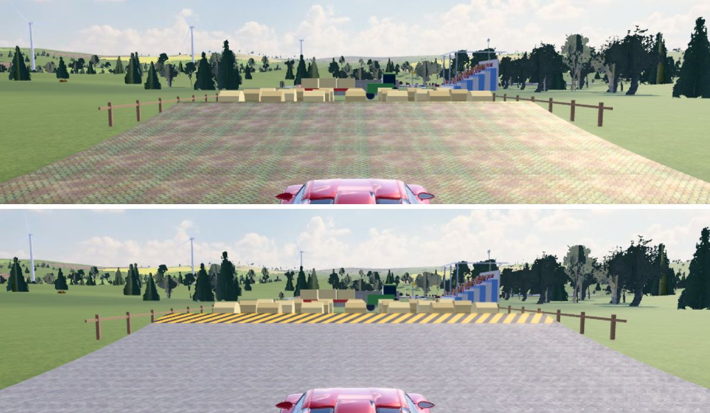

# Mittel n24: kontrollierbar, Sprünge nicht zu weit, Schanze sauber (05.10.2026)

Peter (03.10.): „Stuntbahn Mittel: Sprünge gehen zu weit und Auto ist unkontrollierbar schnell. Idee: weniger schnell
beschleunigen. Textur der Sprungschanze sieht ungustiös aus.“

Davor kam Etappe 1 (G-Kräfte und Show-Tacho, `GKRAFT_BERICHT.md`).

**Alle Zahlen in diesem Bericht sind echte km/h** (Physik). Der Show-Tacho zeigt unter 250 km/h mehr an: echte 100 → Tacho 154,
echte 157 → Tacho ~190. Wo eine Tacho-Zahl gemeint ist, steht „Tacho“ dabei.

## Was sich auf Mittel ändert
1. **Sanftere Beschleunigung.**
   - 0–100 km/h in 3,1 s statt 1,6 s, 0–200 km/h in 7,1 s statt 2,8 s.
   - Ab ~100 km/h lässt der Schub weich nach, über 200 km/h geht es nur noch zäh.
   - Höchsttempo ~264 km/h statt ~560 km/h (der Tacho zeigt dann ebenfalls 264).
   - Gas baut sich in 0,45 s auf (der Handy-Gasknopf ist digital), Gas weg wirkt sofort.
   - Nitro schiebt weiter: Dauer-Nitro käme auf höchstens ~305 km/h, ein 3-s-Schub bringt weniger.
2. **Sprung-Hilfe in der Luft.** Eine kleine Vorausrechnung kennt den Aufsetzpunkt.
   - Zu weit: Es wirkt dezent mehr Schwerkraft (höchstens bis zur echten) und etwas Luftwiderstand, bis das Auto am Ende der
     Landerampe aufsetzt.
   - Zu kurz: etwas weniger Schwerkraft und ein kleiner Schub, bis die ganze Wagenlänge auf der Rampe aufsetzt.
   - Im Tempo-Fenster greift sie gar nicht.
   - Wer viel zu schnell ist, fliegt weiter. Die Hilfe ist bewusst begrenzt, damit sich nichts wie auf Schienen anfühlt.
3. **Schanzen-Hinweis** vor jeder Schanze, oben im HUD, z. B. „🛫 Schanze · 195 km/h ✓“. Die Zahl ist als Show-Tacho-Wert
   angegeben, passend zum Tacho.
   - grün = Tempo passt
   - gelb = „mehr Tempo ▲“
   - rot = „langsamer ▼“

   Die dynamische Ideallinie färbt den Anlauf wie bisher nach derselben Rechnung.
4. **Saubere Schanze** (für alle Stufen):
   - hellgraues Stahl-Riffelblech statt rostig-grünem Blech, ohne Karo-Flimmern in der Ferne
   - gelb-schwarze Warnstreifen an der Lippe (Absprung) und an der Vorderkante der Landerampe
5. **Bestzeiten:**
   - Die Zeiten sind mit der neuen Fahrphysik nicht vergleichbar. Deshalb werden **nur die Mittel-Bestzeiten und -Geister
     einmalig gelöscht**, genauso wie bei n21 („Bestzeiten streichen“), ohne Altlisten.
   - Im Menü steht einmal „🟡 Mittel fährt jetzt zahmer (neue Fahrphysik) – Mittel-Bestzeiten starten neu“.
   - Original-Bestzeiten und Leicht-Zeiten bleiben.

**Leicht und Original sind unverändert**, ebenso Prüffahrt, Autopilot und Leicht-Tempoautomatik. Diese fahren mit dem
bisherigen Antrieb, also bleiben auch alle Schanzen-, Looping- und Röhren-Fenster gleich. Die Schanze sieht auf allen
Stufen neu aus.

**A/B am Handy:** `?m=n23` = Mittel wie bisher, `?antrieb=0.8` = anderer Antrieb (Faktor). Beide werten nicht.

## Messungen

### Beschleunigung, Höchsttempo (`tools/mittel2_mess.mjs`, Ebene, Vollgas inkl. Gas-Rampe)
| | 0–100 km/h | 0–200 km/h | 0–250 km/h | Höchsttempo |
|---|---|---|---|---|
| Original (unverändert) | 1,96 s | 3,53 s | 4,16 s | 558 km/h |
| Mittel n23 | 1,57 s | 2,82 s | 3,37 s | 559 km/h |
| **Mittel n24** | **3,07 s** | **7,08 s** | 13,6 s | **264 km/h** |

Ziel laut Auftrag: 0–100 ≈ 3,0–3,5 s, 0–200 ≈ 7–9 s, Höchsttempo ~260–300 km/h. Alle drei sind erreicht.

**Abstimmung** (`MEDIUM_N24` in `src/game/race.js`, Kappe `driveTaper` in `src/physics/car.js`):
- `drive 0,7` (n23: 1,25)
- `vSoft 100 km/h`, `vTop 350 km/h`: Schub × (1 − k)², ab 350 null, dazu Luftwiderstand → ~264 km/h
- `thrRamp 0,45 s`

Die 0,45 s Rampe statt 0,5 s gaben den Ausschlag: Mit 0,5 s gab es im Test „perfekte Eingabe auf 60 Sammlungs-Strecken“
genau einen Anprall auf sam-023. Mit 0,40 / 0,45 / 0,6 s und anderen Kappen-Werten waren es 0. Das ist ein Grenzfall
auf Messrauschen-Niveau, die Prüfung bleibt mit 0 Crashs streng.

### Sprünge: Anlauftempo und Landung (`node tools/sprung_probe.mjs --n=12 --seeds=7,8,9,10,11`)
12 Generator-Strecken mit 17 Standard-Schanzen (flach, Hochstraße, Gelände; mit kurzem Anlauf), je 5 Durchläufe:
- **mensch-handy** (Brief-Bot): 0,35 s Reaktion, grobe Lenkung, Vollgas außer bei „Bremsen!“ bzw. „langsamer ▼“
- **mensch-voll**: immer Vollgas

| Bot | Stand | Sprünge | **sauber auf der Rampe** | **hinter der Rampe** | zu kurz | Crash bei der Landung | Lippe km/h P10 / Median / P90 / max |
|---|---|---|---|---|---|---|---|
| mensch-handy | n23 | 104 | 53 (51 %) | **40** | 5 | 6 | 90 / 163 / 198 / 202 |
| mensch-handy | **n24** | 97 | **88 (91 %)** | **0** | 2 | 7 | 73 / 134 / 162 / 166 |
| mensch-voll | n23 | 113 | 24 (21 %) | **58** | 18 | 13 | 81 / 199 / 286 / 325 |
| mensch-voll | **n24** | 106 | **82 (77 %)** | **0** | 9 | 15 | 91 / 141 / 187 / 207 |

- **Ziele:**
  - ≥ 85 % saubere Landungen (mensch-handy): **91 %** ✅
  - Keine Flüge hinter das Ende der Landerampe bei Vollgas aus normaler Anfahrt: **0** ✅ (vorher 40 bzw. 58)
- **Ursache vorher:** Mit der alten Beschleunigung kam der Handy-Bot im Median mit 163 km/h an die Lippe (Fenster
  ~140–168 km/h), in 10 % der Fälle mit fast 200 km/h. Der Vollgas-Bot kam bis 325 km/h.
- **Was jede Maßnahme allein bringt** (3 Durchläufe):
  - nur sanfterer Antrieb, ohne Sprung-Hilfe: sauber 59 %, hinter der Rampe 5, aber 16 × zu kurz. Der zahmere Antrieb
    kommt nach kurzem Anlauf nicht immer ins Fenster.
  - mit Sprung-Hilfe: 93 % sauber, 0 hinter der Rampe.
  - Der Schanzen-Hinweis ändert die Bot-Zahlen nicht messbar. Die Bots bremsen schon bei „Bremsen!“, und der Hinweis ist
    für Menschen gedacht.
- „Crash bei der Landung“ (Anprall, harte Landung nach dem Aufsetzen) gibt es mit und ohne Hilfe ungefähr gleich oft.
  Er kommt von der unruhigen Lenkung der Bots in der Luft.

### Menschenähnliche Bots über ganze Runden (`node tools/mittel_probe.mjs --var=neu,n24 --sam=4`, 11 Strecken × 3)
| Bot | Crashs n23 → n24 | Dreher | Zeit / Autopilot |
|---|---|---|---|
| mensch | 119 → **51** | 17 → 16 | 1,38 → 1,37 |
| **mensch-handy** | 234 → **163** | 79 → **27** | 1,81 → 1,73 |
| mensch-touch | 328 → **255** | 79 → 84 | 2,39 → 2,36 |
| mensch-voll | 343 → **247** | 124 → **36** | 2,13 → 1,80 |

Alle 33/33 im Ziel. Weniger Tempo heißt weniger Crashs und Dreher. Die Runde wird trotz des langsameren Autos für
Mensch-Bots nicht langsamer, weil sie seltener zurückgesetzt werden.

### Rundenzeiten (fehlerfreier Fahrer: Lenkung und Pedale wie der Autopilot, Mittel)
| Strecke | n23 | n24 |
|---|---|---|
| Demo | 0:25,71 | 0:28,58 |
| S4711/3 | 1:18,99 | 1:27,33 |
| sam-003 | 2:41,33 | 2:56,96 |
| Schnitt über 11 Strecken (Zeit / Autopilot-Referenz) | 0,97 | **1,07** (+10 %) |

Die „Autopilot-Referenz“ im Menü bleibt die des bisherigen Antriebs. Ein sehr guter Mittel-Fahrer liegt damit ~7 % darüber.

### Schanzen-Belag (`python3 tests/schanze_shots.py quer|hoch [Wurzel] [Name]`)
Gemessen wurde die mittlere Farbe des Belags im Bild: Pixel innerhalb der projizierten Fahrbahn auf dem Schanzen-Bogen,
innere 70 % der Breite. Je Einfach / Standard / Kino × Verfolger / Fern / Nah, quer und hoch:

| | Sättigung | Grün-Stich | Farbe (Standard, nah, quer) |
|---|---|---|---|
| vorher | 0,04–0,18 | bis +0,06 | (174, 167, 149) bräunlich |
| **nachher** | **0,06–0,11** | −0,04 (leicht kühl, Himmelslicht) | (177, 174, 184) hellgrau |

- Die mittlere Farbe täuscht beim alten Belag: Grüne, rostbraune und lila Flecken mitteln sich zu Braungrau.
- **Vision-Befund am Bild (vorher → nachher):** Vorher liegt ein fleckiges Karo-Muster grün/rosa/braun über der ganzen
  Schanze, mit Moiré in der Ferne („Schimmel/Rost“). Nachher ist das Riffelblech sauber hellgrau, die Rauten sind nah
  erkennbar und in der Ferne ruhig. Der Absprung ist an den gelb-schwarzen Streifen klar zu sehen, ebenso die Kante der
  Landerampe.
- **Technik:**
  - `tools/build_deck.mjs` rechnet das CC0-Riffelblech (Poly Haven „Metal Plate“) um: nur die Helligkeit, großflächige
    Flecken per Hochpass entfernt, Normalen auf 60 % gedämpft, Rauheit gleichmäßiger.
  - Material: Albedo-Faktor neutral, wenig Metall (spiegelte sonst den blauen Himmel), Kachel 3 m statt 2,2 m, Normalen ×0,6.
  - Die Streifen sind ein eigenes Canvas, ein dünnes Netz knapp über dem Belag (`src/gfx/jumpdeck.js`), ohne Kollision.
- **Ladebudget kleiner:** WebP 412 → 259 KB, KTX2 630 → 476 KB. Die Streifen brauchen keine Datei.
- `MAT.METAL` gibt es nur an Schanzen: Auffahrt und Landerampe (Generator, Gelände) sowie Klippen-Schanze und Landehang.
  Import-Strecken (.TRK) nutzen Beton bzw. Asphalt.

Fotos (alle mit Vision geprüft):
- `tests/shots/final/schanze_vorher_nachher_quer.jpg`, `…_hoch.jpg`: gleiche Stelle, Standard bzw. Kino
- lokal unter `tests/shots/schanze/` alle 36 Bilder (vorher/nachher × quer/hoch × 3 Stufen × 3 Kameras)
- `tests/shots/mittel3/{quer,hoch}_{schanze_hinweis,flug,landung}.png`: Hinweis „🛫 Schanze · 195 km/h · mehr Tempo ▲“
  (gelb) bei 99 km/h echt, Flug mit Hilfe 0,35, Landung ohne Crash. Am Handy hochkant gut lesbar, nichts verdeckt.

## Tests
- `npm run test:node`: **29/29 grün**, darin neu `test_mittel3.mjs` (21 Prüfungen):
  - Beschleunigung im Zielfenster, n23 und Original unverändert
  - Regler nur auf Mittel, Autopilot/Prüffahrt ohne
  - Gas-Rampe
  - Sprung-Hilfe: 187 km/h ohne Hilfe 65 m in die Rampe (hinter dem Ende), mit Hilfe 41 m (auf der Rampe). 223 km/h:
    108 → 60 m. 133 km/h: ohne Hilfe vor der Rampe, mit Hilfe 8,8 m auf der Rampe. Im Fenster keine Hilfe.
  - Landequote Bots: 92 % / 0 hinter der Rampe
  - Schanzen-Hinweis, Mittel-Bestzeiten einmalig neu, A/B-Links
- `test_assists`: perfekte Eingabe auf 60 Sammlungs-Strecken, 0 Crashs.
- `test_sprung`, `test_kulissen` (Strecke bitgleich) und `test_alte_codes` sind grün.
- Browser, Pixel 7, alle mit 0 Fehlern:
  - `mittel3_shots` quer + hoch: nach 3 s Vollgas 96–99 km/h echt (Tacho 151–153), Hinweis, Sprung, `?m=n23` = 214 km/h
    nach 3 s
  - `schanze_shots` quer + hoch: Belag neutral
  - `smoke`, `test_race`, `test_touch`, `test_reset_ui`, `test_bestzeiten_reset`, `test_leicht_zeiten`, `test_extras_ui`,
    `test_grafik_start`, `mittel2_shots`, `test_kinoreplay beide`, `cockpit_shots`, `gkraft_shots`, `tempo_shots`,
    `test_cockpit_ui`
- **Bildrate** (`tests/perf_gkraft.py`, Standard, Pixel 7 quer, entsperrt, Median aus 3 Läufen, Etappe 1 + 2 zusammen gegen
  den Stand vor n24):

  | Ansicht | vorher | nachher | Unterschied |
  |---|---|---|---|
  | Cockpit | 140,1 fps | 138,3 fps | −1,3 % |
  | Verfolger | 125,9 fps | 126,4 fps | +0,5 % |
  | Replay | 132,6 fps | 132,4 fps | −0,1 % |

  Dazu kommt 1 Draw-Call je Strecke für die Streifen. Die Sprung-Hilfe rechnet nur im Flug (~8 kurze Vorausrechnungen je
  Physikschritt).
- **Live** (Build **9c934fed43**): `test_live` grün (Rennen, offline startbar, 0 Fehler). Stichprobe auf der Live-Seite
  (Mittel, 4711-2):
  - nach 3 s Vollgas 96 km/h echt, Antrieb ×0,7
  - Hinweis „🛫 Schanze · 195 km/h · mehr Tempo ▲“
  - Warnstreifen vorhanden, Sprung ohne Crash, 0 Fehler

## Handy-Test für Peter
1. App einmal ganz schließen und neu öffnen (PWA), dann Mittel fahren. Das Auto zieht spürbar sanfter an. Über
   ~200 km/h auf dem Tacho geht es nur noch langsam weiter.
2. Vor einer Schanze steht oben das Absprung-Tempo. Grün heißt, das Tempo passt. Einfach Vollgas fahren: Das Auto landet auf
   der Rampe, auch wenn es etwas zu schnell oder zu langsam war.
3. Die Schanze ist jetzt hellgrau mit gelb-schwarzer Kante.
4. Zum Vergleich: dieselbe Seite mit `?m=n23` (alter Antrieb, ohne Sprung-Hilfe).

## Regler
| Datei | Was |
|---|---|
| `src/game/race.js` | `MEDIUM_N24` (`drive`, `vSoft`, `vTop`, `thrRamp`, `jumpPull`, `jumpHint`), `JUMP_HINT` (`dist` 160 m / `sec` 4,5 s, `over` 3 m/s) |
| `src/game/jumpassist.js` | `JUMP_PULL` (`lo` 10 m, `hiMargin` 4 m, `aH` 3 m/s², `gUp` 3 m/s², `gDown` 2,5 m/s², `rate` 4/s) |
| `src/physics/car.js` | `driveTaper`, `NITRO_TOP` 1,3 |
| `src/gfx/materials.js` | `MAT.METAL` |
| `src/gfx/jumpdeck.js` | `DECK_MARK` |
