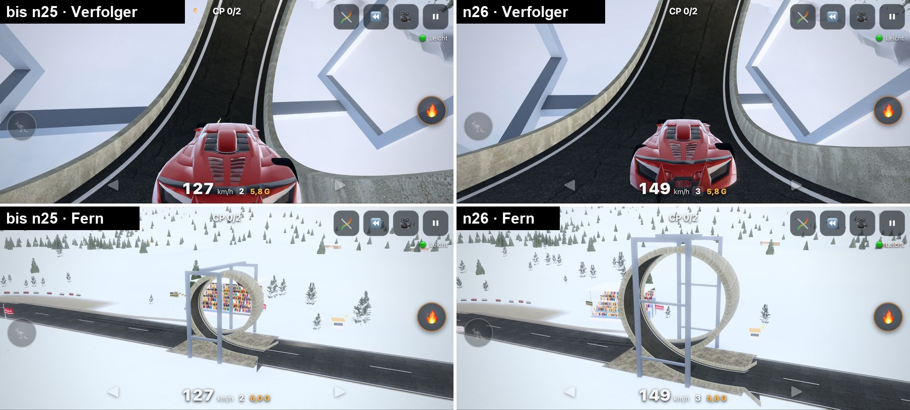
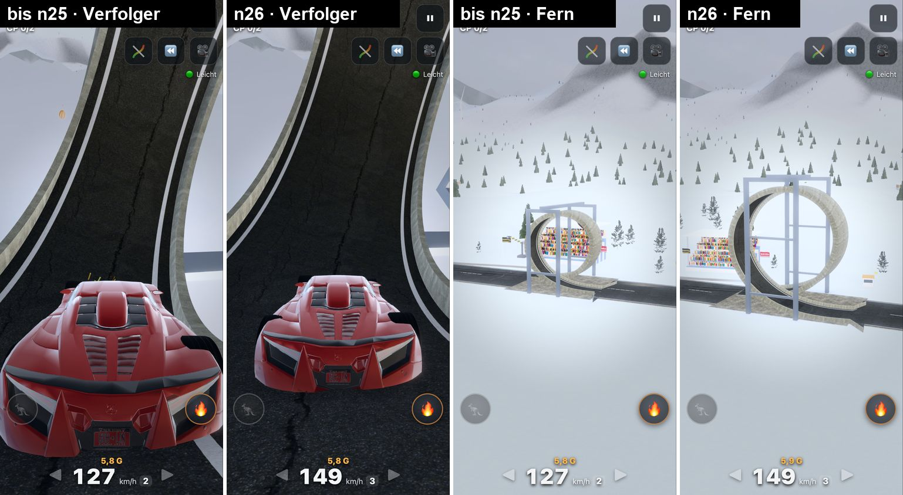

# Stuntbahn n26 – größere Stunt-Bauwerke (05.10.2026)

Peter (03.10.): „Und die Stunteinlagen ebenfalls vergrößern, passend zu den Strecken (beides nicht dringend).“

Seit dem 27.09. ist die Welt doppelt so groß und seit n23 die Fahrbahn 14,6 m breit. Die Stunt-Bauwerke hatten ihr altes
Maß behalten. Looping & Co. wirkten deshalb klein, und die Straße verengte sich am Stunt sichtbar (Looping-Spur 4,5 m,
Röhrenboden 4,4 m). Jetzt wachsen sie mit.

## Kurz
- **Ein Regler `STUNT_SCALE`** (Standard **1,6** = Fahrbahn n23 zu Spur bis n22, 7,3 / 4,5 m). `?stunt=1` baut alles wie
  bis n25 (A/B, wertet nicht); in Node `STUNT_STUNT=1`.
- **Looping** 14,5 → **23,2 m** hoch, Spur 4,5 → **7,2 m**, beide Spuren zusammen **15,8 m** (breiter als die Straße,
  kein Engpass). **Röhre** 7 → **11,2 m** hoch, innen **18,2 m** breit. **Korkenzieher-Rolle** 7,2 → **11,5 m** hoch,
  Spur 7,4 m. **Schanze** höher: Lippe 1,4 → **2,1 m** (15°), Landerampe 2,5 → **4 m**, Scheitel über Grund 5,5 →
  **7,7 m**, Flug 2,3 → **2,75 s**. **Steilwand** Oberkante 14,3 → **18,6 m**, **Halfpipe** Kante 4,8 → **6,4 m**,
  **Schlucht** 22 → **28,6 m** tief. Wellen, Bodenwellen, Kuppe gemessen-gedämpft größer.
- **Alles bleibt in seinen Feldern:** Strecken-Codes und Layouts unverändert, 613 Strecken ohne Überlappung.
- **Erfolgsquote nicht schlechter:** Leicht (Sauber und Brachial) 80/80 im Ziel, **0 Crashs**, alle Stunts 100 %.
  Mittel-Handy-Bot **−15 % Crashs**, Original-Bot gleich (18,9 statt 19,7 je 10 Runden). Prüffahrt: 900 Zufallsstrecken
  ohne Entschärfung.
- **Importe (.TRK, Sammlung) bleiben beim alten Maß.** Begründung unten.
- **Bestzeiten der Zufallsstrecken einmalig neu** (Hinweis im Menü). Sammlung und .TRK behalten ihre Zeiten.
- **Bildrate unverändert** (128,7 gegen 128,6 Bilder/s Standard, 120,6 gegen 120,8 Kino).

## Maße vorher/nachher (`node tools/stunt_masse.mjs`)
| Stunt | Maß | bis n25 | n26 | Faktor |
|---|---|---|---|---|
| Looping | Höhe | 14,5 m | 23,2 m | ×1,60 |
| Looping | Bogenlänge | 56 m | 89,6 m | ×1,60 |
| Looping | Spurbreite | 4,5 m | 7,2 m | ×1,60 |
| Looping | Breite beider Spuren (Straße 14,6 m) | 10,4 m | 15,8 m | ×1,52 |
| Looping | Einfahrt ohne Gas mindestens | 60 km/h | 80 km/h | ×1,35 |
| Röhre | Höhe / Breite innen / Boden | 7,0 / 11,4 / 4,4 m | 11,2 / 18,2 / 7,0 m | ×1,60 |
| Korkenzieher | Höhe / Spurbreite / Länge | 7,2 / 4,6 / 26 m | 11,5 / 7,4 / 41,6 m | ×1,60 |
| Korkenzieher | Höchsttempo (Rollrate) | 48 km/h | 76 km/h | ×1,60 |
| Schanze | Lippe | 11°, 1,44 m | 15°, 2,08 m | ×1,45 |
| Schanze | Landerampe Höhe / Länge | 2,5 / 45 m | 4,0 / 42 m | ×1,60 |
| Schanze | Tempo-Fenster | 140–168 km/h | 122–144 km/h | ×0,86 |
| Schanze | Scheitel über Grund (Rechnung bei vbest) | 5,5 m | 7,7 m | ×1,39 |
| Schanze | Flug / Weite (Rechnung bei vbest) | 2,33 s / 98 m | 2,75 s / 97 m | ×1,18 / gleich |
| Schanze | Autopilot: Lippe / Flug / Scheitel / Weite | 163 km/h / 2,36 s / 4,3 m / 105 m | 138 km/h / 2,72 s / 5,8 m / 102 m | |
| Klippe | Lippe, Fenster 1 / 2 Ebenen | 1,44 m, 53–97 / 53–111 km/h | unverändert | |
| Wellen | Anzahl × Länge, Höhe | 4 × 26 m, 1,9 m | 3 × 32 m, 2,34 m | ×1,23 |
| Bodenwellen | Länge, Höhe | 5 m, 0,42 m | 6,5 m, 0,55 m | ×1,30 |
| Kuppe | Höhe (80 m lang) | 6,8 m | 8,0 m | ×1,18 |
| Steilwand | Wandbreite / Oberkante (68°) | 15,4 / 14,3 m | 20,1 / 18,6 m | ×1,30 |
| Halfpipe | Radius / Kante / Breite | 9 / 4,8 / 31,3 m | 12 / 6,4 / 36,6 m | ×1,33 |
| Schlucht (Gelände) | Tiefe | 22 m | 28,6 m | ×1,30 |

Mitgewachsen: Looping-Stahlrahmen (Abstand, Stützen, Riegel), Banden in Looping und Rolle (0,55 → 0,72 m, an der
Einfahrt flach anlaufend), Röhren-Portal, Korkenzieher-Bügel, Slalom-Blöcke (nur noch in Importen). Das Schanzen-Deck
(n24-Riffelblech, Warnstreifen) liegt automatisch auf den größeren Rampen.

## Warum so – was ich gemessen und entschieden habe
- **Looping:** Höhe, Spur und Rahmen ×1,6. Die beiden Spuren müssen sich dort, wo sie sich kreuzen, seitlich
  ausweichen. Mit Spurversatz ×1,6 entstand am Boden eine Lücke, durch die ein geradeaus fahrendes Auto (Mittel, Hände
  weg) unter dem Looping durchrollte und als „Abkürzung“ zurückgesetzt wurde. Jetzt bleibt die Lücke so schmal wie
  bisher (Versatz = halbe Spur + 0,7 m). Der Seitenversatz verteilt sich über die Anfahrt **und** die ersten 13 % der
  Schleife: Gekreuzt wird erst ~14 m nach der Einfahrt in 1,7 m Höhe, an der Einfahrt liegt die Abfahrt-Spur noch 8 m
  darüber. Damit ist der Schlenker vor der Einfahrt so sanft wie beim alten Looping (Krümmung 0,017 statt 0,036 1/m).
- **Schanze:** Das Element ist 3 Felder (120 m) lang und war schon gefüllt. **Weiter** geht deshalb nicht (Weite bleibt
  ~100 m), **höher** schon: steilere Lippe, höhere Rampen. Steiler als 15° würde mit Übertempo wieder zur „orbitalen
  Startrampe“ (n21): Mittel kann bis 264 km/h; bei 240 km/h fliegt das Auto jetzt ~21 m hoch statt ~11 m. Dafür zieht die
  **Mittel-Sprunghilfe** kräftiger (bis 6 statt 3 m/s² nach unten, 4,5 statt 3 m/s² bremsen): Vollgas-Bot 0 von 29
  Sprüngen hinter der Rampe (mit der alten Stärke 5), Handy-Bot 24/26 sauber wie bisher. Das niedrigere Fenster braucht
  weniger Anlauf, das passt zur zahmeren Mittel-Beschleunigung aus n24.
- **Klippe:** Mit der höheren Schanzen-Lippe (Hang neu gesucht, 45–90 km/h) schafften Original-Bot 82 → 77 % und
  Mittel-Bot 89 → 86 % (12 Seeds). Mit der bisherigen Lippe sind es 83 / 90 %. Die Klippe behält deshalb ihre n21-Schanze.
  **Tiefer** geht sie nicht: Die Fallhöhe sind die Ebenen der Strecke (6/12 m), und das Layout bleibt. Tiefer ist dafür die
  **Schlucht** der Gelände-Strecken (28,6 m).
- **Wellen:** 3 m hoch auf 35 m (×1,6) ließ den Original-Bot an den Kuppen abheben und aufschlagen (80 → 49 % geschafft).
  Mit **gleicher Steigung** wie bisher (2,34 m auf 32 m) sind es 79 % (vorher 81 %, 12 Seeds).
- **Bodenwellen ×1,3 statt ×1,6:** Mit ×1,6 überschlug sich der Original-Bot öfter (99,3 → 96,6 %), mit ×1,3 sind es
  97,8 % bei weniger Crashs insgesamt.
- **Kuppe ×1,18:** Die Bodenhaftung bei Tempo (n21) hält das Auto mit 180 km/h bis ×1,24 am Boden, ab ×1,3 hebt es ab.
- **Spirale:** Sie füllt ihre 2×2 Felder schon (Radius = halbes Feld, wuchs mit der Welt) und bleibt.
- **Importe (.TRK, Sammlung) bleiben beim alten Maß:** Die Strecken des Klassikers stapeln Bauwerke dicht (Sprünge über
  Röhren und Korkenzieher, Hochstraßen in 6-m-Ebenen). Mit dem großen Maßstab ragte die 11 m hohe Röhre in Flugbahnen:
  Korpus 200 Archiv-Strecken, Leicht im Ziel 95 → 90,5 %, 9 × „Überschlag an einer Lücke“. Die Sammlung ist außerdem
  eingefroren (Autopilot-Referenzzeiten im Paket, Bestzeiten). Sie baut jetzt Byte für Byte wie vorher.
- **Mittel-Hinweise:** Im großen Looping blinkte „Bremsen!“ statt „Looping – Spurhilfe“, und vor jedem Looping kam ein
  unnötiges „Bremsen!“. Die Brems-Rechnung kennt jetzt die Steig-Energie im Looping (oben ist man von selbst langsamer),
  und im Looping/in der Röhre gibt es keinen Brems-Hinweis mehr (nur bei großem Maßstab, `?stunt=1` unverändert).

## Fenster erreichbar, Anlauf reicht (alle drei Stufen)
- **Prüffahrt** (Autopilot wie im Spiel, `node tools/stunt_quote.mjs 100`): 900 Zufallsstrecken (flach, 3D, Gelände ×
  3 Stufen × 100), alt und neu **alle ohne Entschärfung im Ziel**. Autopilot-Referenz +0,1 … +2 % (größere Bauwerke).
- **Tempo-Profil:** auf 36 Teststrecken kein Punkt, an dem der Anlauf das Mindesttempo nicht erreicht.
- **Mittel (n24-Antrieb)** mit „perfektem“ Fahrer auf 20 Strecken: kein Festfahren, kein „Zu kurz“.
- Looping ohne Gas: ab 80 km/h Einfahrt kommt man über den Scheitel (vorher 60). Mit Gas geht jedes Tempo.

## Keine Überlappung (`node tools/stunt_check.mjs`, 613 Strecken: 120 Seeds × flach/3D/Gelände, Galerien, 250 Sammlung)
Geprüft an den Ecken aller Kollisionsdreiecke jedes Stunt-Bauwerks (Fahrbahn, Banden, Stützen, Bügel, Portale):
| | bis n25 | n26 |
|---|---|---|
| Bauwerk im Lichtraum einer anderen Fahrbahn (0,25 … 4,6 m über ihr) | 0 | 0 |
| Bäume/Tribünen/Masten/Banden auf einem Bauteil | 0 | **0** (erst 434 an der größeren Halfpipe → behoben) |
| Gelände über einer Stunt-Fahrbahn | 62 (Wellen, ≤ 4 cm) | 0 |
| weiter aus dem Feld als bis n25 | – | nein (alle Arten gleich) |

Behoben unterwegs: Deko und Werbebanden hielten nur Abstand zur Fahrbahn, nicht zur ganzen Halfpipe-Breite. Jetzt zählt
die Halfpipe mit Viertelröhren und Kante (`deco.js`).

## Erfolgsquoten (`node tools/stunt_mess.mjs`, 80 Zufallsstrecken: 30 flach, 25 Gelände, 25 3D, alle Stufen)
Leicht je 1 Runde je Fahrstil, Mittel-Handy-Bot und Original-Bot je 12 Seeds (960 Runden). „geschafft“ = Stück ohne
Crash/Reset/Abkürz-Rücksetzer durchfahren.

| | Leicht Sauber | Leicht Brachial | Mittel-Handy | Original |
|---|---|---|---|---|
| im Ziel | 80/80 → 80/80 | 80/80 → 80/80 | 960/960 → 960/960 | 960/960 → 960/960 |
| Crashs je 10 Runden | 0 → **0** | 0 → **0** | 21,9 → **18,6** | 19,7 → **18,9** |
| Rundenzeit | +1,1 % | +1,3 % | −3,4 % | +0,1 % |
| Looping | 100 → 100 % | 100 → 100 % | 52 → **64 %** | 94 → 92 % |
| Röhre | 100 → 100 % | 100 → 100 % | 74 → **92 %** | 65 → **76 %** |
| Korkenzieher | 100 → 100 % | 100 → 100 % | 19 → 48 % (n ≈ 25) | 72 → 86 % (n ≈ 15) |
| Schanze | 100 → 100 % | 100 → 100 % | 86 → 87 % | 91 → **94 %** |
| Klippe (1 / 2 Ebenen) | 100 / 100 % | 100 / 100 % | 89 / 71 → 89 / 57 % | 82 / 90 → 82 / 95 % |
| Steilwand | 100 → 100 % | 100 → 100 % | 86 → **98 %** | 97 → 98 % |
| Wellen | 100 → 100 % | 100 → 100 % | 100 → 99 % | 81 → 77 % |
| Bodenwellen / Kuppe | 100 / 100 % | 100 / 100 % | 100 / 100 → 100 / 100 % | 99 / 99 → 98 / 99 % |
| Halfpipe | 100 → 100 % | 100 → 100 % | 100 → 99 % | 97 → 97 % |
| Schanzen-Landungen sauber | 100 → 100 % | 91 → **100 %** | 86 → 84 % | (fliegt fast immer zu weit) |
| Flugzeit Schanze (Median) | 2,32 → 2,67 s | 2,34 → 2,69 s | 2,14 → 2,58 s | 2,57 → 3,07 s |

Einordnung:
- **Leicht:** unverändert fehlerfrei, Brachial landet jetzt jede Schanze sauber (vorher 5 × zu weit).
- **Mittel** profitiert von den breiteren Spuren (Looping, Röhre, Rolle, Steilwand). Etwas häufiger landet es knapp hinter
  der etwas kürzeren Landerampe (32 statt 20 von ~730, auf der folgenden Geraden, kein Crash). „Klippe 2 Ebenen“ (n ≈ 56)
  ist geometrisch unverändert; die Abweichung kommt davon, wie der Bot nach den anderen Bauwerken ankommt.
- **Original-Bot** (grob: lenkt 0,1 s verzögert mit Rauschen, bremst erst bei 20 % über Plan): insgesamt nicht öfter
  Crashs. Im Looping 94 → 92 %: Am großen Looping liegt das Plantempo an der Einfahrt höher; wer 20 % zu schnell ankommt,
  dreht sich im Anfahrts-Schlenker (`node tools/looping_crash.mjs`). Ich habe sanfteren Schlenker, anlaufende Banden,
  schmalere Spuren und mehr Reserve im Plan probiert. Die Banden und der sanfte Schlenker sind drin, der Rest ändert nichts
  (das Tempo kommt aus der Höchstlast 6,2 g im Looping, nicht vom Schlenker).

Rohdaten: `tests/out/n26/` (mess.md, mess_*.json, masse.md, check_*.log, korpus_*.log, quote_*.log, perf.log; lokal,
nicht im Repo).

## Bilder (je Stunt: oben Verfolger, unten Fernsicht, links bis n25, rechts n26)
Galerie-Fahrt mit dem Autopiloten, im spektakulärsten Moment angehalten (`python3 tests/stuntgroesse_shots.py quer|hoch`,
Collagen `python3 tools/stunt_collage.py`):

| Stunt | quer | hoch |
|---|---|---|
| Looping |  |  |
| Röhre | [quer](tests/shots/final/stunt_roehre_quer.jpg) | [hoch](tests/shots/final/stunt_roehre_hoch.jpg) |
| Korkenzieher | [quer](tests/shots/final/stunt_korkenzieher_quer.jpg) | [hoch](tests/shots/final/stunt_korkenzieher_hoch.jpg) |
| Schanze | [quer](tests/shots/final/stunt_schanze_quer.jpg) | [hoch](tests/shots/final/stunt_schanze_hoch.jpg) |
| Steilwand | [quer](tests/shots/final/stunt_steilwand_quer.jpg) | [hoch](tests/shots/final/stunt_steilwand_hoch.jpg) |
| Halfpipe | [quer](tests/shots/final/stunt_halfpipe_quer.jpg) | [hoch](tests/shots/final/stunt_halfpipe_hoch.jpg) |
| Schlucht | [quer](tests/shots/final/stunt_schlucht_quer.jpg) | [hoch](tests/shots/final/stunt_schlucht_hoch.jpg) |
| Wellen | [quer](tests/shots/final/stunt_wellen_quer.jpg) | [hoch](tests/shots/final/stunt_wellen_hoch.jpg) |
| Kuppe, Bodenwellen, Klippe | [Kuppe](tests/shots/final/stunt_kuppe_quer.jpg) · [Bodenwellen](tests/shots/final/stunt_bodenwellen_quer.jpg) · [Klippe](tests/shots/final/stunt_klippe_quer.jpg) | [Kuppe](tests/shots/final/stunt_kuppe_hoch.jpg) · [Bodenwellen](tests/shots/final/stunt_bodenwellen_hoch.jpg) · [Klippe](tests/shots/final/stunt_klippe_hoch.jpg) |

Selbst angesehen („wirkt der Stunt im Verhältnis zur Strecke groß und spektakulär, kein Engpass?“):
- **Looping:** Der neue ist sichtbar ein Bauwerk über der Straße. Die Spur ist so breit wie die Fahrbahn, der Rahmen
  steht außerhalb. Im Verfolger hochkant füllte die alte Spur kaum die Bildbreite, die neue lässt links und rechts Luft.
- **Röhre:** Die alte Öffnung war schmaler als die Straße, die neue ist breiter. Innen wirkt sie wie ein Tunnel statt wie
  ein Rohr.
- **Korkenzieher, Steilwand, Halfpipe:** klar größer; die Steilwand von innen gesehen ist eine Wand, kein Randstein.
- **Schanze:** Auto am Scheitel deutlich höher über der Landerampe, Rampen höher, Warnstreifen sichtbar.
- **Wellen, Kuppe, Bodenwellen:** bewusst nur moderat größer (siehe oben), wirken etwas kräftiger, nicht spektakulär.
- **Schlucht:** tiefer, das Wasser liegt sichtbar weiter unten. **Klippe:** unverändert (Absicht).

## Kamera
- **Verfolger:** unverändert gut – Looping/Röhre/Rolle im Bild, nie verdeckt (3D-Test: 0 von 114 Bildern hinter
  Bauteilen). Der Test wartet nach dem Vorspulen jetzt 8 statt 2 Bilder, bis die Kamera wie im Spiel nachgeglitten ist; mit
  2 Bildern war er schon bis n25 an einer Steilrampe rot (1/140).
- **Kino-Replay:** Das Stativ am Looping steht mit dem Stunt-Maßstab weiter weg (×√1,6) und nimmt den ganzen Looping
  ins Bild (Ausschnitt ×1,6). Test im Browser grün (quer/hoch).
- **Replay „Strecke“:** Masten an großen Loopings und Röhren 7 m weiter weg und 3,6 m höher.

## Bestzeiten
Auf Zufallsstrecken (flach, 3D, Gelände, Demo, Galerie) ändern sich Fahrlinie und Zeiten, und alte Geister würden durch die
alten Bauwerke fahren. Deshalb werden deren Mittel- und Original-Bestzeiten samt Geistern **einmal** gelöscht (wie n24),
mit dem Hinweis „🌀 Größere Stunts … Bestzeiten der Zufallsstrecken starten neu, Sammlung und .TRK bleiben“. Leicht-Zeiten
bleiben (werten ohnehin nicht). Der Zwischenspeicher geprüfter Strecken ist je Stunt-Maßstab getrennt. `?stunt=1` und
andere Maßstäbe werten nicht.

## Bildrate (`python3 tests/perf_stunt.py <alter Stand>`, Pixel 7 quer, vorher/nachher abwechselnd, je 2 Läufe)
| | bis n25 | n26 |
|---|---|---|
| Fahrt Gelände 12 s, Standard | 128,6 Bilder/s | 128,7 Bilder/s |
| Fahrt Gelände 12 s, Kino | 120,8 Bilder/s | 120,6 Bilder/s |
| Bildzeit am Looping / Röhre / Rolle / Schanze / Wand / Wellen (Kino) | 7,6 / 9,1 / 10,4 / 9,1 / 10,7 / 8,9 ms | 8,1 / 8,7 / 10,5 / 8,4 / 9,7 / 7,9 ms |
| Draw-Calls / Dreiecke am Looping (Kino) | 81 / 296 k | 79 / 295 k |

## Tests
- `npm run test:node`: **31/31 grün**, neu `tests/node/test_stuntgroesse.mjs` (Maße, Fenster erreichbar auf 36 Strecken,
  Mittel ohne Festfahren, Überlappung auf 37 Strecken, Importe beim alten Maß, Spurlücke, Bestzeiten einmalig neu, kein
  „Bremsen!“ im Looping, `STUNT_STUNT=1` baut 99 Strecken samt Tempo-Profil Byte für Byte wie n25).
- Angepasst: `test_sprung` (n26-Fenster, mit `STUNT_STUNT=1` die n21-Werte), `test_mittel3` (Test-Tempi relativ zum
  Schanzen-Fenster), `test_strecken3d` (Klippe mit eigener Lippe), `test_gelaende` (Bitgleich-Nachweis mit alter Breite
  **und** alten Stunts), `test_assists` (Spurhilfe am Looping-Rand mit dem Spiel-Zeiger), `wiese_probe` (Startpunkte je
  Stück statt je Punktnummer).
- Browser: Rauchtest Pixel 7 quer, Hochformat (Drehen), 3D-Strecken, Gelände, Rennen/Bestzeit/Geist/Replay, Grafik-Start,
  Kino-Replay quer+hoch: alle grün, **0 JS-Fehler** (auch alle 88 Fotos quer und hoch ohne Fehler).

## Live-Prüfung (05.10.2026, https://drpeterkalmar.github.io/stuntbahn/)
- Build **58b378326d** live = lokal, HTTP 200, Start 4,4 s, Strecke des Tages mit dem Autopiloten im Ziel ohne Crash,
  Service-Worker aktiv, offline startbar, **0 Fehler** (`python3 tests/test_live.py`).
- Galerie live auf Pixel 7 **hochkant und quer**: Stunt-Maßstab 1,6, Looping **23,2 m** hoch, Spur **7,2 m**; mit
  `?stunt=1` Maßstab 1 und 14,5 m wie bis n25; Autopilot-Fahrt ohne Crash, **0 JS-Fehler**.

## Am Handy
Die App einmal ganz schließen und neu öffnen, dann lädt die neue Version. Beim ersten Öffnen erscheint der Hinweis zu den
neuen Bestzeiten.

## Code
- `src/track/defs.js`: `STUNT_SCALE`, `STUNT_TAG`, `stuntK(k, a)` (gedämpftes Wachstum).
- `src/track/pieces.js`: `loopGeom(k)`, `tubeGeom(k)`, `jumpDef(k)`/`JUMP_N26`, Bodenwellen, Kuppe, Looping-Einfahrt.
- `src/track/pieces_trk.js`: `corkGeom(k)`, Röhre/Slalom im Maßstab des Stücks (`pb.ss`).
- `src/track/pieces_3d.js`: `waveGeom(k)`, `WALL`, `CLIFF_KICK`. `src/track/gelaende.js`: Halfpipe, Schlucht.
- `src/track/build.js`: Maßstab je Strecke (`layout.stuntScale`, Importe 1), Rahmen/Portal/Banden, `opt.tagCol`.
- `src/game/warn.js`, `race.js`, `jumpassist.js`, `store.js`, `ui.js`, `cinecam.js`, `gfx/camera.js`, `track/deco.js`.
- Werkzeuge: `tools/stunt_masse.mjs`, `stunt_check.mjs`, `stunt_mess.mjs`, `stunt_quote.mjs`, `stunt_bitgleich.mjs`,
  `looping_crash.mjs`, `sprunghilfe_probe.mjs`, `stunt_collage.py`; `tests/stuntgroesse_shots.py`, `tests/perf_stunt.py`.
